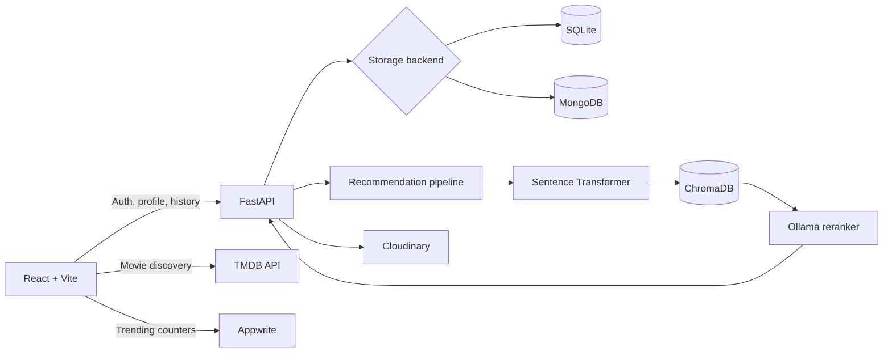

# Movie Man


Movie Man is a full-stack movie discovery and recommendation application. It combines a React interface, FastAPI authentication and profiles, MovieLens data, ChromaDB semantic search, sentence-transformer embeddings, and optional Ollama reranking.

[](https://react.dev/)
[](https://vite.dev/)
[](https://fastapi.tiangolo.com/)
[](https://www.trychroma.com/)
[](https://www.mongodb.com/)
[](https://www.docker.com/)

## Overview:


## Features

- Natural-language movie recommendations with semantic vector search
- Optional Ollama reranking with human-readable recommendation reasons
- Email or username authentication
- Persistent profiles, watchlists, and recommendation history
- Personalized recommendations based on previous searches
- TMDB-powered discovery, posters, trailers, credits, and genre browsing
- Avatar and banner uploads through Cloudinary
- Responsive React dashboard with taste signals and AI history
- SQLite support for local development and MongoDB support for production
- Docker, Render, and Vercel deployment configuration

## Architecture



The API deliberately lazy-loads the embedding model and ChromaDB recommendation components. Authentication, profiles, and health checks can therefore run without loading the ML stack into memory.

## Technology

| Area | Stack |
| --- | --- |
| Frontend | React 19, Vite 6, React Router, Tailwind CSS |
| API | FastAPI, Pydantic, Uvicorn |
| Authentication | PBKDF2 password hashing, signed bearer tokens |
| Recommendation | Sentence Transformers, ChromaDB, optional Ollama |
| Data | MovieLens, Pandas, NumPy, PyArrow |
| Persistence | SQLite or MongoDB |
| Media | TMDB and Cloudinary |
| Deployment | Docker, Render, Vercel |

## Project Structure

```text
Movie-Recommendation-AI/
|-- frontend/                         React and Vite application
|   |-- src/components/               Movie cards, search, modal, spinner
|   |-- src/pages/                    Authentication, dashboard, genres
|   |-- src/hooks/                    Recommendation and history hooks
|   |-- src/lib/                      Authentication helpers
|   `-- vercel.json                   SPA routing configuration
|-- src/movie_recommender/
|   |-- api/main.py                   FastAPI routes and auth
|   |-- config.py                     Environment-based settings
|   |-- data/                         MovieLens loading and preprocessing
|   |-- db/                           SQLite and MongoDB stores
|   |-- embeddings/                   Sentence-transformer wrapper
|   |-- recommender/                  Retrieval and reranking pipeline
|   |-- vector_db/                    ChromaDB utilities
|   `-- media/                        Cloudinary integration
|-- scripts/                          Dataset and index utilities
|-- tests/                            Backend tests
|-- chroma_storage/                   Prebuilt local vector index
|-- Dockerfile                        Production backend image
|-- render.yaml                       Render service blueprint
`-- pyproject.toml                    Python package and dependencies
```

## Prerequisites

- Python 3.10 or newer
- Node.js 18 or newer
- npm
- A TMDB API read-access token
- Optional: MongoDB Atlas, Cloudinary, Appwrite, and Ollama

## Local Setup

### 1. Clone the repository

```bash
git clone https://github.com/MIhirDas10/Movie-Recommendation-AI.git
cd Movie-Recommendation-AI
```

### 2. Configure the backend

Create a virtual environment and install the project:

```bash
python -m venv .venv
```

Windows PowerShell:

```powershell
.\.venv\Scripts\Activate.ps1
pip install -e .
```

macOS or Linux:

```bash
source .venv/bin/activate
pip install -e .
```

Create `.env` in the repository root:

```dotenv
APP_ENV=development
APP_HOST=0.0.0.0
APP_PORT=8000

STORAGE_BACKEND=sqlite
AUTH_SECRET=replace-with-a-long-random-secret

ENABLE_OLLAMA=true
OLLAMA_BASE_URL=http://localhost:11434
OLLAMA_MODEL=llama3.1:8b

TMDB_API_KEY=your-tmdb-read-access-token

# Optional production services
MONGODB_URI=
MONGODB_DB_NAME=moviesite
CLOUDINARY_CLOUD_NAME=
CLOUDINARY_API_KEY=
CLOUDINARY_API_SECRET=
```

Do not commit `.env` or real credentials.

### 3. Prepare recommendation data

The repository includes ChromaDB storage used by the deployed application. To rebuild the data locally:

```bash
python scripts/download_movielens.py
python scripts/build_index.py --recreate
```

The index build downloads or loads MovieLens data, creates sentence-transformer embeddings, and writes them to `chroma_storage/`.

### 4. Run the API

```bash
uvicorn movie_recommender.api.main:app --reload
```

Useful endpoints:

- API health: `http://localhost:8000/health`
- Swagger UI: `http://localhost:8000/docs`
- OpenAPI schema: `http://localhost:8000/openapi.json`

### 5. Configure and run the frontend

Create `frontend/.env.local`:

```dotenv
VITE_API_URL=http://localhost:8000
VITE_TMDB_API_KEY=your-tmdb-read-access-token

# Optional Appwrite trending-search integration
VITE_APPWRITE_PROJECT_ID=
VITE_APPWRITE_DATABASE_ID=
VITE_APPWRITE_COLLECTION_ID=
```

Then start Vite:

```bash
cd frontend
npm install
npm run dev
```

Open `http://localhost:5173`.

## API Overview

| Method | Endpoint | Purpose |
| --- | --- | --- |
| `GET` | `/health` | Service health check |
| `POST` | `/auth/signup` | Create an account |
| `POST` | `/auth/login` | Log in with username or email |
| `GET` | `/auth/me` | Validate a bearer token |
| `GET` | `/profile` | Load the current profile |
| `PUT` | `/profile` | Update profile and watchlist data |
| `POST` | `/profile/upload` | Upload avatar or banner media |
| `POST` | `/recommend` | Generate movie recommendations |
| `GET` | `/history` | List recommendation history |
| `GET` | `/history/{query_id}` | Load one history entry |

### Example recommendation request

```bash
curl -X POST http://localhost:8000/recommend \
  -H "Content-Type: application/json" \
  -d "{\"query\":\"mind-bending science fiction with emotional stakes\",\"top_k\":5}"
```

### Example signup request

```bash
curl -X POST http://localhost:8000/auth/signup \
  -H "Content-Type: application/json" \
  -d "{\"displayName\":\"Movie Fan\",\"username\":\"moviefan\",\"email\":\"fan@example.com\",\"password\":\"change-me\"}"
```

Authenticated endpoints expect:

```http
Authorization: Bearer <token>
```

## Tests and Checks

Backend:

```bash
pytest
```

Frontend:

```bash
cd frontend
npm run lint
npm run build
```

## Deployment

### Backend on Render

The repository includes `Dockerfile` and `render.yaml`.

1. Create a Render Blueprint or Docker web service from this repository.
2. Set the production environment variables listed below.
3. Deploy the `main` branch.
4. Confirm `/health` returns `{"status":"ok"}`.

Recommended Render variables:

```dotenv
APP_ENV=production
ENABLE_OLLAMA=false
STORAGE_BACKEND=mongodb
MONGODB_URI=your-mongodb-connection-string
MONGODB_DB_NAME=moviesite
AUTH_SECRET=your-long-stable-secret
FRONTEND_ORIGINS=https://your-project.vercel.app
```

Add Cloudinary and TMDB variables when those features are enabled. Keep `AUTH_SECRET` stable across deployments; changing it invalidates existing login tokens.

### Frontend on Vercel

Use these Vercel project settings:

| Setting | Value |
| --- | --- |
| Root Directory | `frontend` |
| Framework Preset | Vite |
| Build Command | `npm run build` |
| Output Directory | `dist` |

Required frontend variables:

```dotenv
VITE_API_URL=https://your-render-service.onrender.com
VITE_TMDB_API_KEY=your-tmdb-read-access-token
```

The backend CORS settings must include the final Vercel deployment origin.

## Troubleshooting

### Browser reports a CORS error

First open the backend `/health` endpoint directly. Render `404`, `502`, or `503` responses can appear as CORS errors because they are platform responses rather than FastAPI responses.

Then verify:

- `VITE_API_URL` points to the correct Render service.
- Render deployed the latest `main` commit.
- `FRONTEND_ORIGINS` contains the exact Vercel origin.
- The backend is listening on Render's `$PORT`.

### Login works but profile redirects to login

- Keep `AUTH_SECRET` stable across Render restarts and deployments.
- Confirm `/auth/me` returns `200` with the stored token.
- Clear stale local storage once after changing authentication secrets.
- Deploy the latest frontend, which only clears authentication on `401` or `403`.

### Render exceeds 512 MB

Authentication and profile routes do not load the embedding model. The recommendation endpoint does. On a 512 MB instance, sentence-transformer and ChromaDB requests may still require a larger plan or an external embedding service.

### API returns `422`

FastAPI validation rejected the request. For signup, passwords must contain at least six characters and all required fields must be present.

## Security Notes

- Never commit `.env`, database passwords, Cloudinary secrets, or API tokens.
- Use a long random `AUTH_SECRET` in production.
- Restrict MongoDB network access appropriately.
- Rotate any credential that has been exposed in screenshots, logs, or Git history.

## License

This project is available under the [MIT License](LICENSE).
